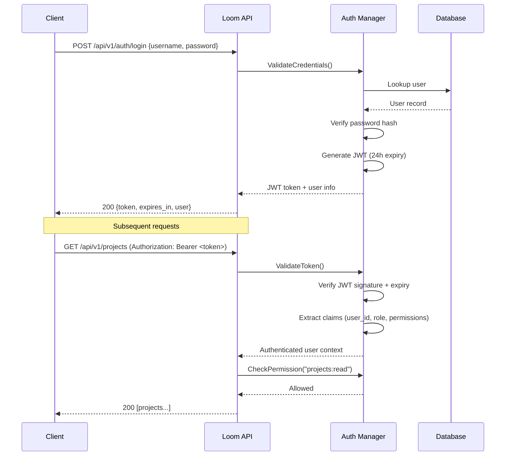

## API Authentication & Authorization

Loom secures API access with **JWT bearer tokens** and **API keys**. All protected endpoints require one of these:

- **Bearer token:** `Authorization: Bearer <token>`
- **API key:** `X-API-Key: <key>`

Public endpoints (health checks, static assets) do not require authentication.

---

### Authentication Flow



---

### Default Admin

- **Username:** `admin`
- **Password:** `admin`

Change the password immediately after first login:

```bash
# Login
TOKEN=$(curl -s -X POST http://localhost:8080/api/v1/auth/login \
  -H "Content-Type: application/json" \
  -d '{"username":"admin","password":"admin"}' | jq -r .token)

# Change password
curl -X POST http://localhost:8080/api/v1/auth/change-password \
  -H "Authorization: Bearer $TOKEN" \
  -H "Content-Type: application/json" \
  -d '{
    "current_password": "admin",
    "new_password": "<strong-password>"
  }'
```

---

### Login & Token Refresh

**Login:**
```bash
curl -X POST http://localhost:8080/api/v1/auth/login \
  -H "Content-Type: application/json" \
  -d '{"username": "admin", "password": "<password>"}'
```

Response:
```json
{
  "token": "eyJhbGciOiJIUzI1NiIs...",
  "expires_in": 86400,
  "user": {
    "id": "usr-abc123",
    "username": "admin",
    "email": "admin@example.com",
    "role": "admin",
    "is_active": true
  }
}
```

**Refresh** (before the token expires):
```bash
curl -X POST http://localhost:8080/api/v1/auth/refresh \
  -H "Authorization: Bearer $TOKEN"
```

Returns a new token with a fresh expiry.

---

### API Keys (Service-to-Service)

API keys are for automated integrations, CI/CD pipelines, and service accounts.

**Create an API key:**
```bash
curl -X POST http://localhost:8080/api/v1/auth/api-keys \
  -H "Authorization: Bearer $TOKEN" \
  -H "Content-Type: application/json" \
  -d '{
    "name": "ci-bot",
    "permissions": ["agents:read", "beads:read", "projects:read"],
    "expires_in": 86400
  }'
```

Response:
```json
{
  "id": "key-abc123",
  "name": "ci-bot",
  "key": "loom_k_abc123def456...",
  "permissions": ["agents:read", "beads:read", "projects:read"],
  "expires_at": "2025-01-02T00:00:00Z"
}
```

The full key is returned **once** — store it securely. Use it in requests:

```bash
curl -H "X-API-Key: loom_k_abc123def456..." \
  http://localhost:8080/api/v1/projects
```

---

### User Management

**Create a user** (admin only):
```bash
curl -X POST http://localhost:8080/api/v1/auth/users \
  -H "Authorization: Bearer $TOKEN" \
  -H "Content-Type: application/json" \
  -d '{
    "username": "alice",
    "email": "alice@example.com",
    "role": "user",
    "password": "secure-password"
  }'
```

**List users** (admin only):
```bash
curl -H "Authorization: Bearer $TOKEN" \
  http://localhost:8080/api/v1/auth/users
```

**Get current user:**
```bash
curl -H "Authorization: Bearer $TOKEN" \
  http://localhost:8080/api/v1/auth/me
```

---

### Roles & Permissions

#### Built-in Roles

| Role | Description | Default Permissions |
|---|---|---|
| `admin` | Full system access | `*:*` (all permissions) |
| `user` | Standard access | Read + write on most resources |
| `viewer` | Read-only access | Read on all resources |
| `service` | Service account | Custom per API key |

#### Permission Format

Permissions follow the `resource:action` pattern. Wildcard `*:*` grants all permissions.

#### Permission Matrix

| Resource | `read` | `write` | `delete` | `admin` |
|---|---|---|---|---|
| `agents` | View agents | Create/update agents | Remove agents | Full agent control |
| `beads` | View beads | Create/update beads | Delete beads | Full bead control |
| `providers` | View providers | Register/update providers | Remove providers | Full provider control |
| `projects` | View projects | Create/update projects | Delete projects | Full project control |
| `decisions` | View decisions | Create/resolve decisions | Delete decisions | Full decision control |
| `system` | — | — | — | System administration |
| `repl` | — | `use`: Access CEO REPL | — | — |

**Role-resource mapping:**

| | agents | beads | providers | projects | decisions | system | repl |
|---|---|---|---|---|---|---|---|
| **admin** | RWDA | RWDA | RWDA | RWDA | RWDA | A | use |
| **user** | RW | RW | R | RW | RW | — | use |
| **viewer** | R | R | R | R | R | — | — |
| **service** | *per key* | *per key* | *per key* | *per key* | *per key* | — | — |

*R = read, W = write, D = delete, A = admin*

---

### Auth Endpoints Reference

| Method | Endpoint | Auth Required | Description |
|---|---|---|---|
| `POST` | `/api/v1/auth/login` | No | Login, returns JWT |
| `POST` | `/api/v1/auth/refresh` | Yes | Refresh JWT token |
| `POST` | `/api/v1/auth/change-password` | Yes | Change password |
| `GET` | `/api/v1/auth/me` | Yes | Get current user |
| `POST` | `/api/v1/auth/users` | Admin | Create user |
| `GET` | `/api/v1/auth/users` | Admin | List all users |
| `POST` | `/api/v1/auth/api-keys` | Yes | Create API key |

---

### Configuration Reference

In `config.yaml`:

```yaml
security:
  enable_auth: true              # Enable authentication (default: false)
  jwt_secret: "your-secret"     # JWT signing secret (auto-generated if empty)
  allowed_origins:               # CORS allowed origins
    - "http://localhost:8080"
    - "https://your-domain.com"
  webhook_secret: ""             # GitHub webhook verification secret
```

**CORS headers** are set to allow: `Content-Type`, `X-API-Key`, `Authorization`.

**Production recommendations:**
- Set `enable_auth: true`
- Use a stable, random `jwt_secret` (tokens become invalid if the secret changes)
- Restrict `allowed_origins` to your actual domains
- Change the default admin password
- Use HTTPS (`enable_https: true` with TLS cert/key)
