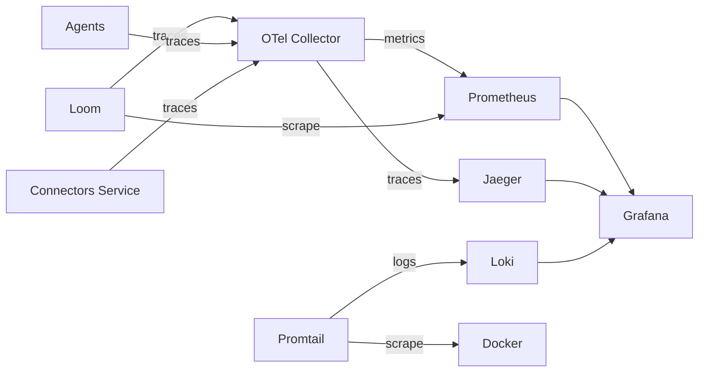

# Observability

Loom includes a complete observability stack for metrics, tracing, and logging.

## Architecture

## Metrics (Prometheus)

Access Prometheus at `http://localhost:9090`.

Loom exports custom metrics:

| Metric | Description |
|---|---|
| `loom.beads.total` | Total beads in system |
| `loom.beads.completed` | Beads completed |
| `loom.agent.iterations` | Agent loop iterations |
| `loom.dispatch.latency` | Dispatch latency (ms) |
| `loom.agent.execution_time` | Agent execution time (ms) |
| `loom.workflows.started` | Workflows started |
| `loom.workflows.completed` | Workflows completed |

## Distributed Tracing (Jaeger)

Access Jaeger at `http://localhost:16686`.

All services are instrumented with OpenTelemetry spans:

- **loom**: HTTP requests, dispatch operations, workflow execution
- **agents**: Action loop iterations, individual action execution
- **connectors-service**: gRPC operations, health checks

## Logging (Loki)

Access logs in Grafana at `http://localhost:3000` via the Loki data source.

Promtail scrapes Docker container logs and forwards them to Loki with labels:

- `container` -- Container name
- `service` -- Docker Compose service name
- `project` -- Compose project name

## Grafana Dashboards

Pre-configured dashboards at `http://localhost:3000` (admin/admin):

- **Loom Overview** -- System health, bead throughput, agent utilization
- Data sources pre-configured: Prometheus, Loki, Jaeger (with trace-to-log correlation)

## Configuration Files

| File | Purpose |
|---|---|
| `config/prometheus.yml` | Prometheus scrape targets |
| `config/otel-collector-config.yaml` | OTel Collector pipelines |
| `config/loki/local-config.yaml` | Loki storage and schema |
| `config/promtail/config.yml` | Promtail log scraping |
| `config/grafana/datasources/` | Grafana data source provisioning |
| `config/grafana/dashboards/` | Grafana dashboard provisioning |
