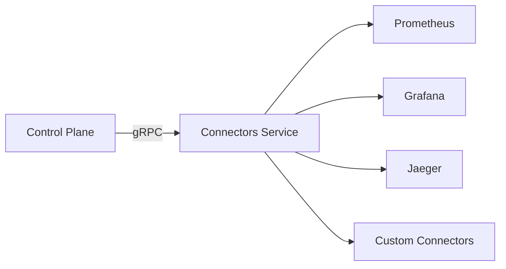

# Connectors

Connectors provide a plugin-like architecture for external service integrations. The Connectors Service runs as an independent gRPC microservice.

## Architecture



The control plane communicates with connectors through a `ConnectorService` interface that abstracts over local (in-process) and remote (gRPC) backends. When `CONNECTORS_SERVICE_ADDR` is set, the control plane uses the remote gRPC client; otherwise, it falls back to the in-process manager.

## Connector Types

| Type | Examples |
|---|---|
| `observability` | Prometheus, Grafana, Jaeger |
| `agent` | OpenClaw |
| `storage` | S3, MinIO |
| `messaging` | Slack, Discord |
| `database` | External databases |
| `custom` | User-defined |

## Adding a Custom Connector

1. Implement the `Connector` interface in `pkg/connectors/`:

```go
type Connector interface {
    ID() string
    Name() string
    Type() ConnectorType
    Description() string
    Initialize(ctx context.Context, config Config) error
    HealthCheck(ctx context.Context) (ConnectorStatus, error)
    GetEndpoint() string
    GetConfig() Config
    Close() error
}
```

2. Register the factory in `pkg/connectors/manager.go` `AddConnector()`
3. The connector will be accessible via both the REST API and gRPC

## gRPC API

The Connectors Service exposes these RPCs (defined in `api/proto/connectors/connectors.proto`):

| RPC | Description |
|---|---|
| `ListConnectors` | List all connectors (optional type filter) |
| `GetConnector` | Get connector details and config |
| `RegisterConnector` | Add a new connector |
| `RemoveConnector` | Delete a connector |
| `HealthCheck` | Check single connector health |
| `HealthCheckAll` | Check all connectors |

## Configuration

Connectors are configured via `config/connectors.yaml`:

```yaml
connectors:
  - id: prometheus
    name: Prometheus
    type: observability
    mode: local
    enabled: true
    host: prometheus
    port: 9090
    scheme: http
    health_check:
      enabled: true
      interval: 30s
      timeout: 5s
      path: /-/healthy
```
