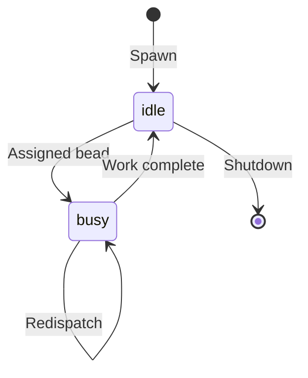

# Agents & Personas

My agents are the hands that do the work. Each one has a persona -- a role that defines what it knows, what it cares about, and what kind of beads it picks up. Think of personas as job descriptions and agents as the people filling them.

## The Roster

| Persona | Role | What They Do |
|---|---|---|
| CEO | Strategic leadership | High-level calls, project direction, tie-breaking |
| Engineering Manager | Technical leadership | Architecture, code review, mentoring |
| Code Reviewer | Quality gate | PR reviews, code quality, catching mistakes |
| Web Designer | UI/UX | Interface design, accessibility, user experience |
| QA Engineer | Testing | Writing tests, verifying fixes, regression checks |
| DevOps Engineer | Infrastructure | CI/CD, deployment, monitoring, containers |
| Project Manager | Planning | Task breakdown, scheduling, tracking |
| Product Manager | Requirements | PRD expansion, user stories, feature gaps |
| Documentation Manager | Docs | Technical writing, keeping things accurate |

I also have a few more specialized roles: a Remediation Specialist for fixing things that are broken, a Housekeeping Bot for cleanup, and a few others. Check the Personas tab for the full list.

## How Agents Work

When I assign a bead to an agent, it enters what I call the **action loop**:

1. I give the agent the task context and a set of available actions
2. The LLM decides what to do -- read a file, write code, run a test
3. I execute the action and hand the result back
4. The LLM looks at what happened and decides the next step
5. Repeat until the agent says it's done or hits the iteration limit

This loop is the core of everything. It's how a simple instruction like "fix this bug" turns into an agent that reads the codebase, identifies the problem, writes a fix, runs the tests, and commits the result. All without anyone holding its hand.

Available actions include: `bash`, `file_read`, `file_write`, `file_search`, `file_tree`, `git_commit`, `git_push`, `git_status`, `git_diff`, `create_pr`, `create_bead`, `close_bead`, `verify`, and `done`.

## Agent Lifecycle



Agents are born idle. I give them work. They do it. They go back to idle. If a bead needs to be re-examined (maybe the code review found something), I redispatch it and the agent picks it back up. Simple.

## Spawning Agents

Click **Spawn New Agent** in the Agents tab, or:

```bash
curl -X POST http://localhost:8080/api/v1/agents \
  -H "Content-Type: application/json" \
  -d '{
    "persona_name": "engineering-manager",
    "project_id": "my-project"
  }'
```

If you don't give the agent a name, I'll derive one from the persona. `default/web-designer` becomes `Web Designer (Default)`. Functional, if not inspired. Feel free to name them yourself.

## Cloning

If you like an agent and want another one just like it:

```bash
curl -X POST http://localhost:8080/api/v1/agents/<id>/clone \
  -H "Content-Type: application/json" \
  -d '{"name": "The Other Engineer"}'
```

Same persona, new identity. Useful when you need more throughput on a particular role.

## Scaling

For bulk scaling, I support Docker Compose replicas:

```bash
make scale-coders N=3    # Three coder agents
make scale-reviewers N=2 # Two reviewers
make scale-qa N=2        # Two QA agents
```

More agents means more parallel work. Just make sure you have enough provider capacity to keep them all thinking.
