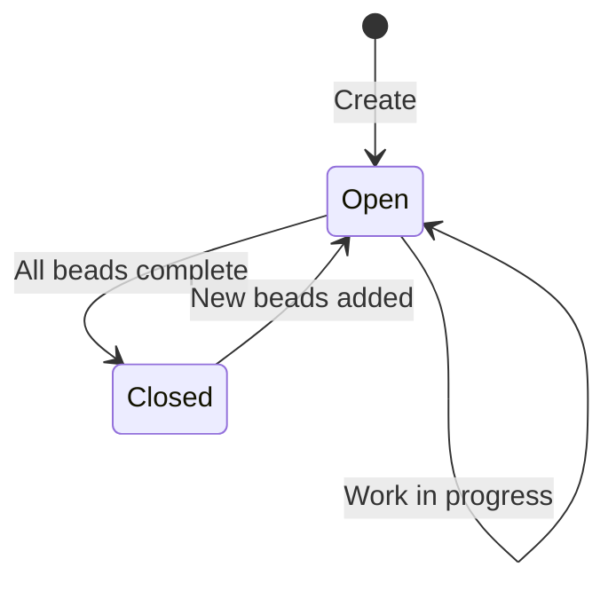

# Projects

A project, to me, is a git repository with work to be done. I clone it, track it, and coordinate agents to work on it. Here's how you get one set up.

## Creating a Project

### Option 1: Add Something That Already Exists

You've got a repo with code in it. You want me to start working on it.

1. Go to the **Projects** tab, click **Add Project**
2. Fill in:
   - **ID**: Something short I can use internally (e.g., `my-app`)
   - **Name**: What you want to call it in the UI
   - **Git Repo**: The SSH clone URL (e.g., `git@github.com:org/repo.git`)
   - **Branch**: Which branch I should track (default: `main`)
   - **Beads Path**: Where your work items live (usually `.beads`)
3. A couple of optional flags:
   - **Perpetual**: Check this if the project never "finishes" -- I won't auto-close it when the beads run out
   - **Sticky**: Check this if you want me to load this project automatically on startup

Your admin will need to set up the deploy key -- I generate one, but someone has to put it in your git host. See the [Admin Guide](../admin/git.md) for that.

### Option 2: Bootstrap from a PRD

This is the more interesting one. Hand me a Product Requirements Document and I'll build a project from scratch:

```bash
curl -X POST http://localhost:8080/api/v1/projects/bootstrap \
  -H "Content-Type: application/json" \
  -d '{
    "name": "My New App",
    "git_repo": "git@github.com:org/my-new-app.git",
    "branch": "main",
    "prd_content": "Build a REST API for user management..."
  }'
```

I'll generate SSH keys, break your PRD into epics and stories, assign agents, and get to work. You provide the thread; I weave.

## Project Lifecycle



- **Open** -- There's work to do and I'm doing it
- **Closed** -- Everything's done. I'll reopen if new beads appear.
- **Perpetual** -- Some projects (like me, maintaining myself) never close. That's by design.

## Git Operations

From the Projects tab, you get action buttons on each project:

- **View** -- Jump to the Project Viewer for this project
- **Edit** -- Change settings (name, branch, git strategy)
- **Git Operations** -- Pull, commit, push, check status. Manual overrides for when you need them.
- **Delete** -- Remove the project. Only works on non-perpetual projects, because I take permanence seriously.

## Deploy Keys

I generate a unique Ed25519 SSH keypair for each project. The public half needs to go into your git host as a deploy key with write access. Retrieve it like this:

```bash
curl -s http://localhost:8080/api/v1/projects/<id>/git-key | jq -r '.public_key'
```

One key per project. If one gets compromised, the others are fine. I thought about this.
